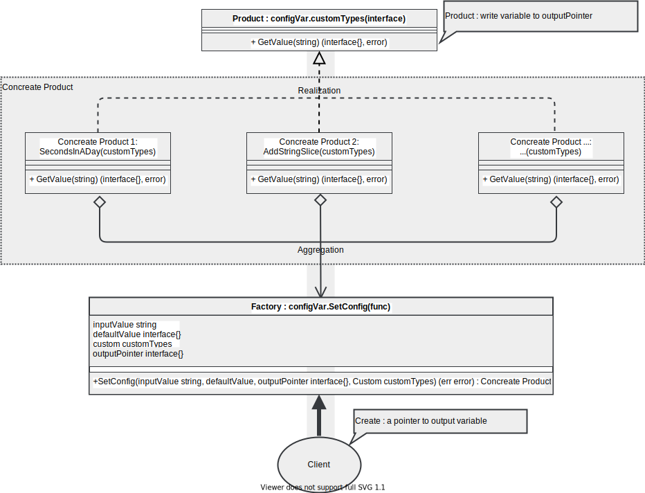

'Config To Variable' a golang example of using the Simple Factory (Design Pattern).

## Before
Frist you should know design pattern 'simple factory':
https://www.programmersought.com/article/76233705716/

<!-- -->


## Example
Just see the code :)

```go
package main

import (
	"fmt"
	"strconv"
	"strings"
	configVar "customVariableExample/customVar"
)

func main() {

	var err error

	var defBool bool
	err = customVar.SetValue(true, &defBool, &customVar.SwitchType{})
	if err != nil {
		fmt.Printf("輸出結果: %v (%T), 錯誤提示: %v\n", defBool, defBool, err)
	} else {
		fmt.Printf("輸出結果: %v (%T)\n", defBool, defBool)
	} //輸出結果: true (bool)

	var exBool bool
	err = configVar.SetConfig("ON", false, &exBool, &configVar.SwitchType{})
	if err != nil {
		fmt.Printf("輸出結果: %v (%T), 錯誤提示: %v\n", exBool, exBool, err)
	} else {
		fmt.Printf("輸出結果: %v (%T)\n", exBool, exBool)
	} //輸出結果: true (bool)

	var exInt int8
	err = configVar.SetConfig("60.1", "90", &exInt, &configVar.SecondsInADay{})
	if err != nil {
		fmt.Printf("輸出結果: %v (%T), 錯誤提示: %v\n", exInt, exInt, err)
	} else {
		fmt.Printf("輸出結果: %v (%T)\n", exInt, exInt)
	} //輸出結果: 60 (int8)

	var exUint uint64
	err = configVar.SetConfig("-99.9", "11", &exUint, &customStruct{})
	if err != nil {
		fmt.Printf("輸出結果: %v (%T), 錯誤提示: %v\n", exUint, exUint, err)
	} else {
		fmt.Printf("輸出結果: %v (%T)\n", exUint, exUint)
	} //輸出結果: 11 (uint64), 錯誤提示: input value > '-99.9' > 不可低於10 strconv.ParseUint: parsing "-99": invalid syntax ; default value > <nil>

	var exSlice []uint32
	exSlice = append(exSlice, 123)
	err = configVar.SetConfig("456", "111", &exSlice, &configVar.AddStringSlice{})
	if err != nil {
		fmt.Printf("輸出結果: %v (%T), 錯誤提示: %v\n", exSlice, exSlice, err)
	} else {
		fmt.Printf("輸出結果: %v (%T)\n", exSlice, exSlice)
	} //輸出結果: [123 456] ([]uint32)

	var exCustomTypeSlice []interface{}
	exCustomTypeSlice = append(exCustomTypeSlice, 456)
	err = configVar.SetConfig("Test", "Def", &exCustomTypeSlice, &configVar.AddStringSlice{})
	if err != nil {
		fmt.Printf("輸出結果: %v (%T), 錯誤提示: %v\n", exCustomTypeSlice, exCustomTypeSlice, err)
	} else {
		fmt.Printf("輸出結果: %v (%T)\n", exCustomTypeSlice, exCustomTypeSlice)
	} //輸出結果: [456 Test] ([]interface {})

	exStringMap := make(map[string]interface{})
	exStringMap["原始Key"] = "原始Value"
	err = configVar.SetConfig("VVVVVVVVVVVVV", exStringMap, &exStringMap, &stringMapType{SetKey: "KeyTest"})
	if err != nil {
		fmt.Printf("輸出結果: %v (%T), 錯誤提示: %v\n", exStringMap, exStringMap, err)
	} else {
		fmt.Printf("輸出結果: %v (%T)\n", exStringMap, exStringMap)
	} //輸出結果: map[KeyTest:VVVVVVVVVVVVV 原始Key:原始Value] (map[string]interface {})

	var exCustomTypeMap interface{}
	err = configVar.SetConfig("testKey|t1|t2|t3|t4", nil, &exCustomTypeMap, &customTypeMap{})
	if err != nil {
		fmt.Printf("輸出結果: %v (%T), 錯誤提示: %v\n", exCustomTypeMap, exCustomTypeMap, err)
	} else {
		exCustomTypeMapAssertion := exCustomTypeMap.(map[string]*CustomTypeValue)
		for index, value := range exCustomTypeMapAssertion {
			fmt.Printf("輸出結果: %v %v (%T)\n", index, value, value)
		}
	} //輸出結果: testKey &{t1 t2 t3 t4 } (*main.CustomTypeValue)

}

/* 
	工廠方法函式說明:
	func SetConfig(inputValue string, defaultValue, outputPointer interface{}, Custom customTypes) (err error)
	> 將輸入字串轉換任意變數 (若轉換失敗則輸出設定預設值)
	@param inputValue: 外部輸入變數(需先轉成字串)
	@param defaultValue: 預設值(當自定型別轉換發生錯誤時則輸出此值)
	@param outputPointer:  寫入輸出變數的指標
	@param Custom:  自訂型別，可OOP繼承與方法重載
	@return error : 錯誤提示
*/

type customStruct struct{} //使用者可以自訂型別,藉由OOP繼承與方法重載擴增功能

func (_ customStruct) GetValue(inputValue string) (output interface{}, err error) { //使用者可依需求調整功能

	var cache int
	if index := strings.Index(inputValue, "."); index < 1 { //無條件捨去小數，直接直接取整數
		cache, err = strconv.Atoi(inputValue)
	} else {
		cache, err = strconv.Atoi(inputValue[:index])
	}

	if err != nil {
		return cache, err
	} else if cache < 10 {
		return cache, fmt.Errorf("'%v' > 不可低於10", inputValue)
	} else {
		return cache, nil
	}
}

type stringMapType struct {
	SetKey string
}

func (mp *stringMapType) GetValue(inputValue string) (output interface{}, err error) {
	if len(inputValue) < 10 {
		return nil, fmt.Errorf("'%v' > 字串長度不可低於10", inputValue)
	}

	cache := make(map[string]interface{})
	cache[mp.SetKey] = inputValue
	return cache, nil
}

type customTypeMap map[string]*CustomTypeValue

type CustomTypeValue struct {
	f1 string
	f2 string
	f3 string
	f4 string
}

func (mp customTypeMap) GetValue(inputValue string) (output interface{}, err error) {
	cacheSlice := strings.Split(inputValue, "|")
	if len(cacheSlice) < 5 {
		return nil, fmt.Errorf("'%v' > ' | ' 分隔號數量不可低於5", inputValue)
	} else if cacheSlice[1] == "" || cacheSlice[2] == "" || cacheSlice[3] == "" || cacheSlice[4] == "" {
		return nil, fmt.Errorf("'%v' > 部份數值不可為空", inputValue)
	}

	cacheMap := make(map[string]*CustomTypeValue)
	cacheMap[cacheSlice[0]] = &CustomTypeValue{f1: cacheSlice[1], f2: cacheSlice[2], f3: cacheSlice[3], f4: cacheSlice[4]}
	return cacheMap, nil
}

```


